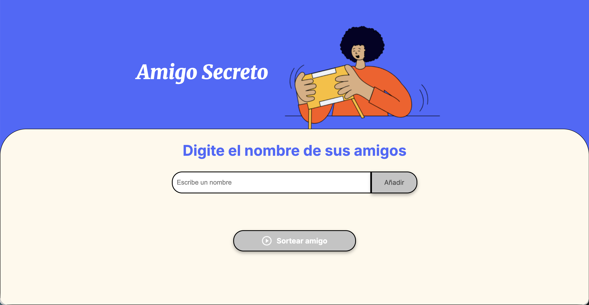
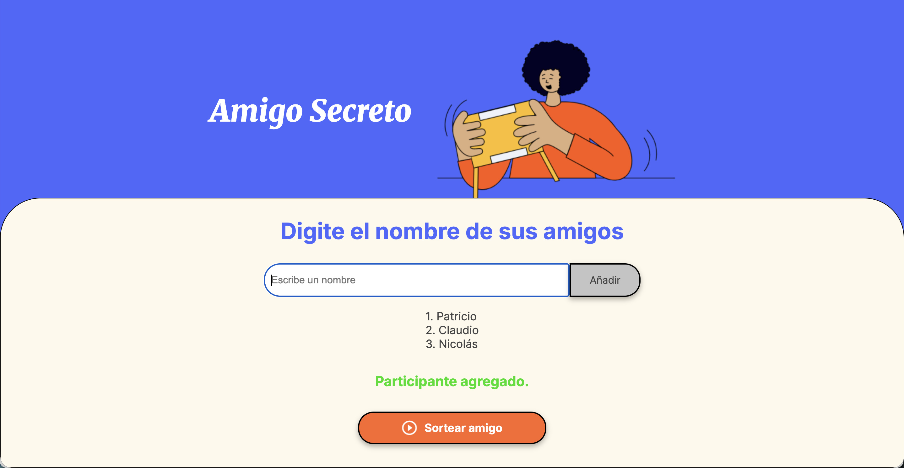
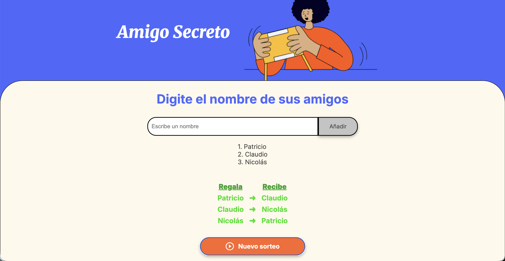

# 🎁 Challenge Amigo Secreto

Aplicación desarrollada en **JavaScript, HTML y CSS** como parte del programa **ONE – Oracle Next Education**.  
El objetivo principal fue **practicar lógica de programación** en un entorno que simula un flujo de trabajo real con Git y GitHub, integrando **mejoras iterativas** en distintas versiones del proyecto.

---

## 🚀 Funcionalidades principales

- Agregar nombres a una lista dinámica.  
- Visualizar la lista de participantes.  
- Realizar el sorteo del **Amigo Secreto**:  
  - Se generan automáticamente las parejas **“Regala → Recibe”**.  
  - Se garantiza que nadie se asigne a sí mismo.  
  - Funciona con listas pares o impares de participantes.  
- Botón dinámico:  
  - Deshabilitado al inicio (**gris**).  
  - Habilitado al añadir participantes (**naranja**).  
  - Cambia a **“Nuevo sorteo”** tras ejecutar un sorteo.  
- **UI mejorada**:  
  - Botones con jerarquía visual clara (tipografía, color y estados).  
  - Resultados organizados en una tabla de dos columnas (**“Regala” / “Recibe”**).  
- Accesibilidad con etiquetas *aria* y feedback visual consistente.

---

## 🛠️ Tecnologías utilizadas

- **HTML5** → Estructura base de la aplicación.  
- **CSS3** → Estilos con enfoque en accesibilidad, jerarquía visual (colores, tipografía, estados).  
- **JavaScript (ES6+)** → Lógica de negocio: funciones, arrays, condicionales, loops y manipulación del DOM.  
- **Git & GitHub** → Control de versiones, ramas por funcionalidad y Pull Requests simulando flujo de equipo.

---

## 📂 Flujo de trabajo y buenas prácticas aplicadas

Este proyecto se gestionó simulando un **entorno laboral real**:

1. **Versión inicial**: estructura del proyecto con HTML y CSS provistos.  
2. **Branches por feature**: cada mejora (**v1, v2, v3, v4, v5**) se desarrolló en ramas independientes (`logica-js-vX`).  
3. **Pull Requests (PRs)**: cada cambio fue revisado y fusionado con la rama main simulando un ciclo de *code review*.  
4. **Commits semánticos** siguiendo convención [Conventional Commits](https://www.conventionalcommits.org/):  
   - Ejemplo: `feat(js): versión funcional v1 (agregar, listar y sortear sin repetición)`  
5. **UI/UX Iterativo**: se aplicaron mejoras visuales y de accesibilidad (botones, estados, feedback visual).

---

## 📸 Capturas de pantalla

### Pantalla inicial (sin participantes)

### Lista de participantes y botón activo

### Resultado del sorteo

---

## 🤝 Contribución

Este proyecto es de carácter educativo. Si quieres contribuir:  
1. Haz un fork del repositorio.  
2. Crea una rama con tu mejora: `git checkout -b feature/nueva-mejora`.  
3. Haz commit de tus cambios: `git commit -m 'feat: descripción de la mejora'`.  
4. Haz push a la rama: `git push origin feature/nueva-mejora`.  
5. Abre un Pull Request.

---

## 📜 Licencia

Este proyecto se comparte bajo la licencia **MIT**.  
Eres libre de usar, modificar y distribuir el código para fines educativos o profesionales.

---

✨ Proyecto realizado como parte del **Challenge Amigo Secreto - ONE (Oracle Next Education)**, destacando **buenas prácticas de programación, control de versiones y diseño iterativo con foco en UI/UX**.
